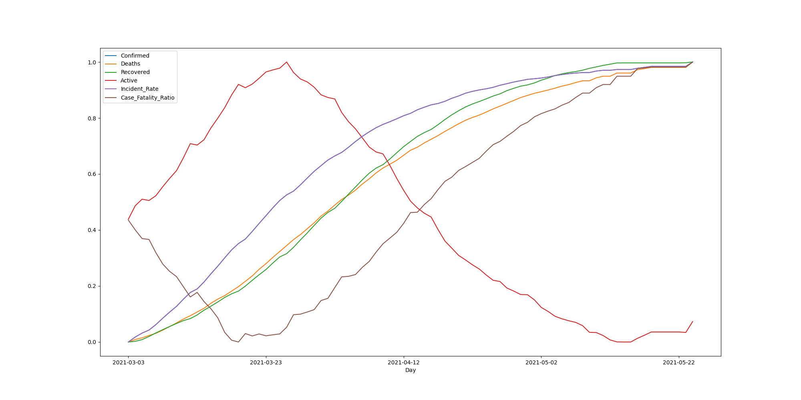

# Building Airflow Pipeline to generate reports for Jordan from 2020 to now,

# Data Source from COVID-19 Data Repository by the Center for Systems Science and Engineering (CSSE) at Johns Hopkins University up to now.

# Jordan Scoring Report

# How to Run Project

> mkdir dags logs plugins pgadmin postgres-db-volume

> docker-compose up airflow-init
> docker-compose up

> pgAdmin : http://localhost:8000/

> Airflow : http://localhost:8080/
